# ML Paradigms

```mermaid
graph LR;
A[ML Paradigms] --> AA[Supervised Learning]
    AA --> AAA[Regression]
        AAA --> AAAA[Methods to make model]
            AAAA --> AAAAA[Linear Regression]
            AAAA --> AAAAB[Polynomial Regression]
            AAAA --> AAAAC[Locally Weighted Linear Regression]
            AAAA --> AAAAD[Decision Trees]
            AAAA --> AAAAE[K Nearest Neighbours]
            AAAA --> AAAAF[SVM]
            AAAA --> AAAAG[Ensemble Learning]
            AAAA --> AAAAH[Random Forest]
    AA --> AAB[Classification]
        AAB --> AABA[Binary Classification]
            AABA --> AABAA[Linear Regression for Classification]
            AABA --> AABAB[Logistic Regression]
            AABA --> AABAC[K Nearest Neighbours]
            AABA --> AABAD[SVM -> can do both linear and non linear classification]
        AAB --> AABB[Multi Class Classification]
            AABB --> AABBA[Linear Regression for Classification using Strategies]
            AABB --> AABBB[Decision Trees]
            AABB --> AABBC[Gaussian Naive Bayes Theorem]
            AABB --> AABBD[Ensemble Learning]
            AABB --> AABBE[Random Forest]

A --> AB[Unsupervised Learning]
    AB --> ABA[Rule Mining]
    AB --> ABB[Clustering]
    AB --> ABC[Feature Selection]
    AB --> ABD[Collaborative Filtering]
A --> AC[Reinforcement Learning]

````

# Features

```mermaid
graph TD;
B[Features] --> BA[Numeric]
B --> BB[Strings]
    BB --> BBA[Nominal]
    BB --> BBB[Ordinal]

C[Distance] --> CA[Manhattan Distance]
C --> CB[Euclidean Distance]
C --> CC[Minkowski's Distance]
```
# Errors

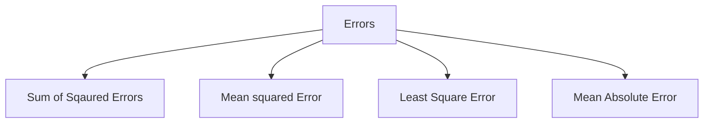
# Linear Regression

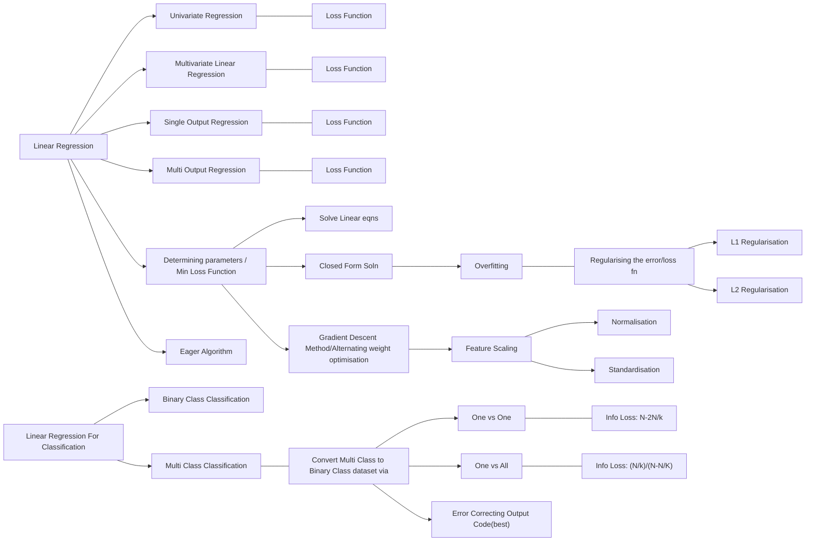
# KNN

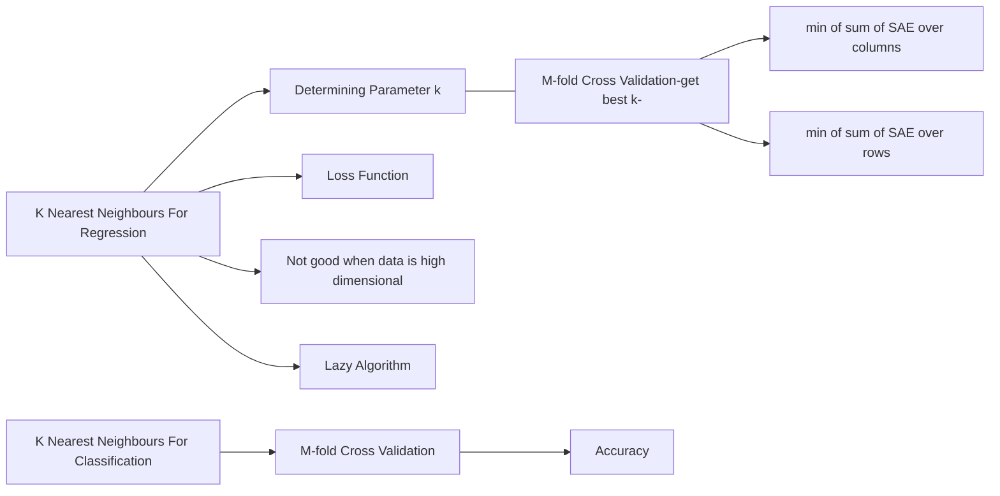

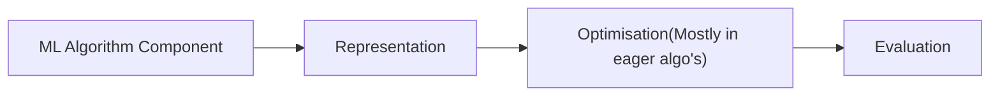
# Logistic Regression

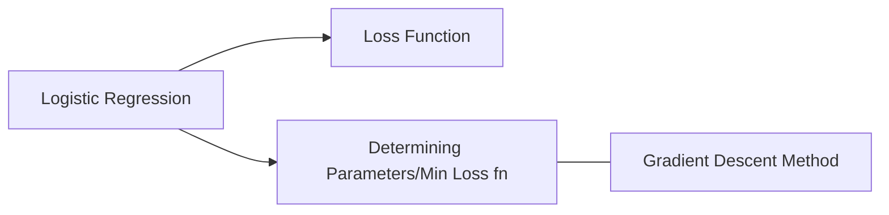
Normalisation;Standardisation(For Linear Regression);Correlation

# Decision Trees

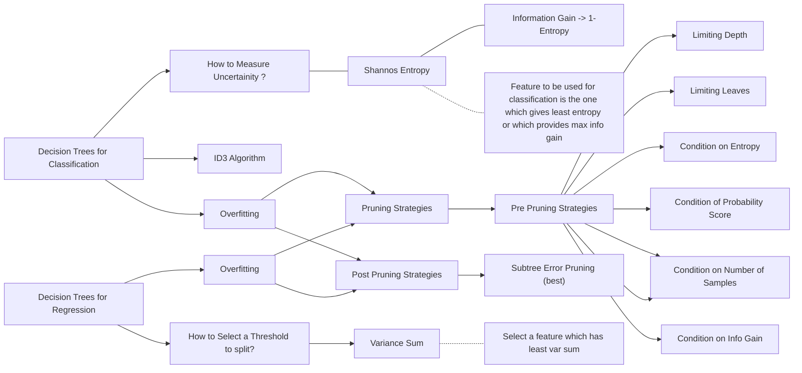
https://www.analyticsvidhya.com/blog/2020/06/4-ways-split-decision-tree/

# SVM

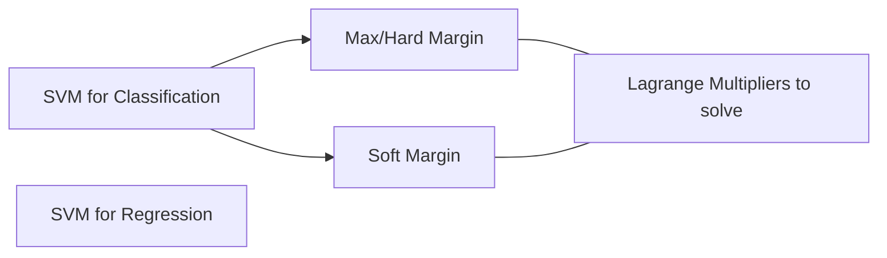

# Random Forest
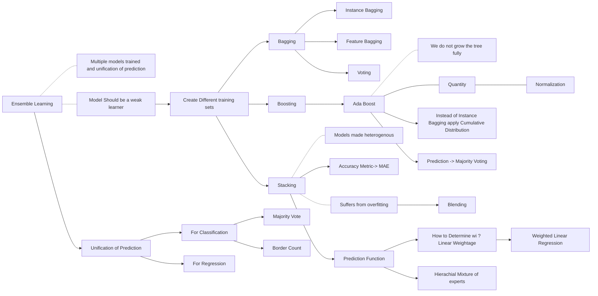

# Gaussian Naive Bayes Theorem

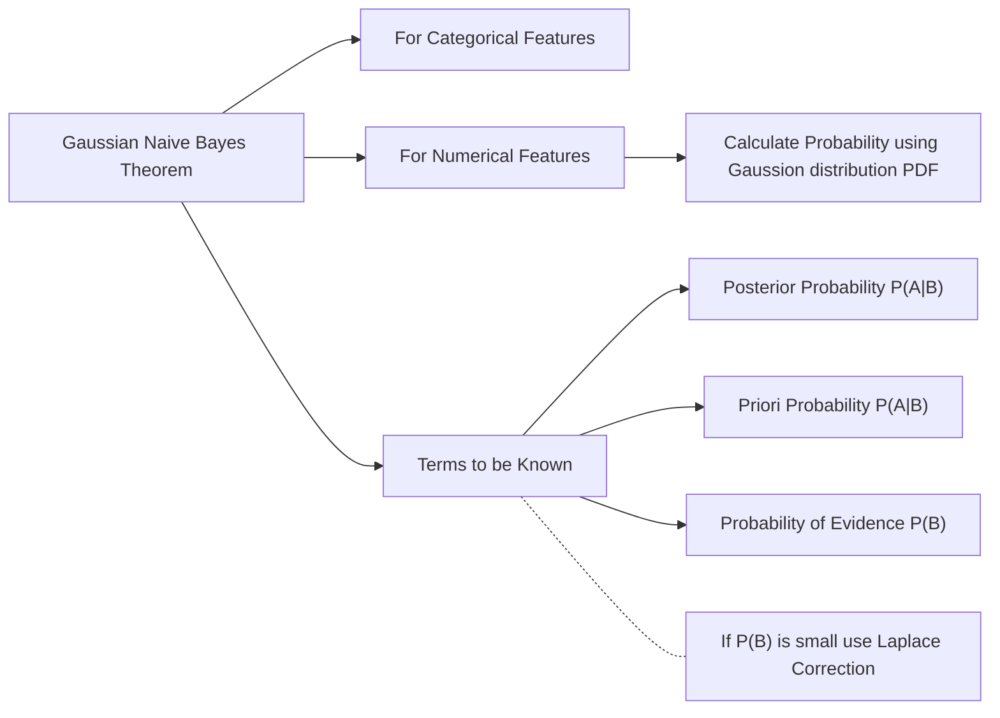

# Accuracy Metrics
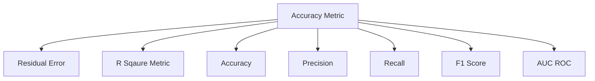

# Deep Learning
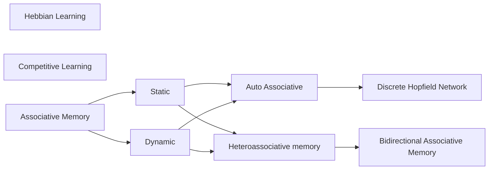