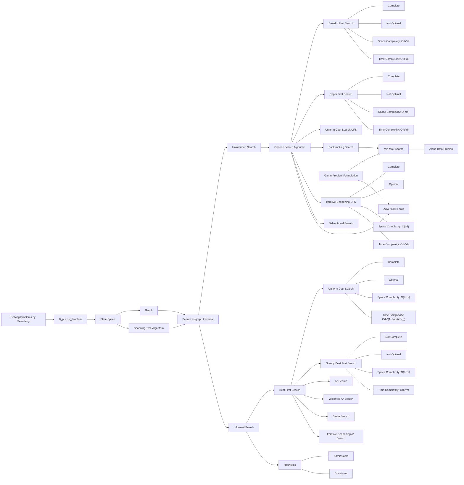
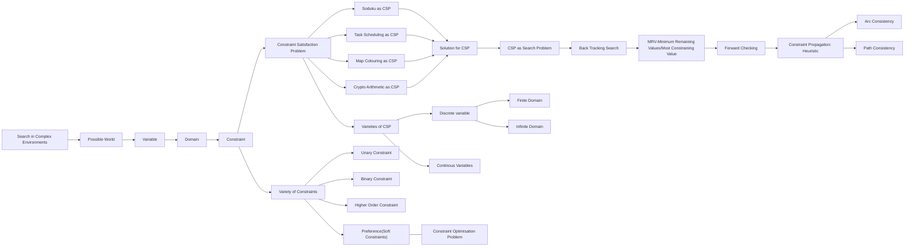
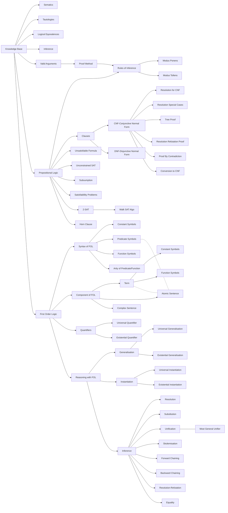
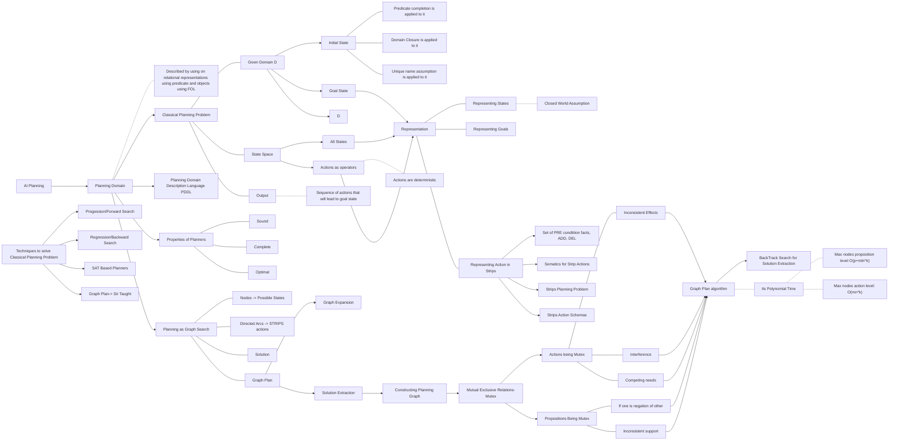
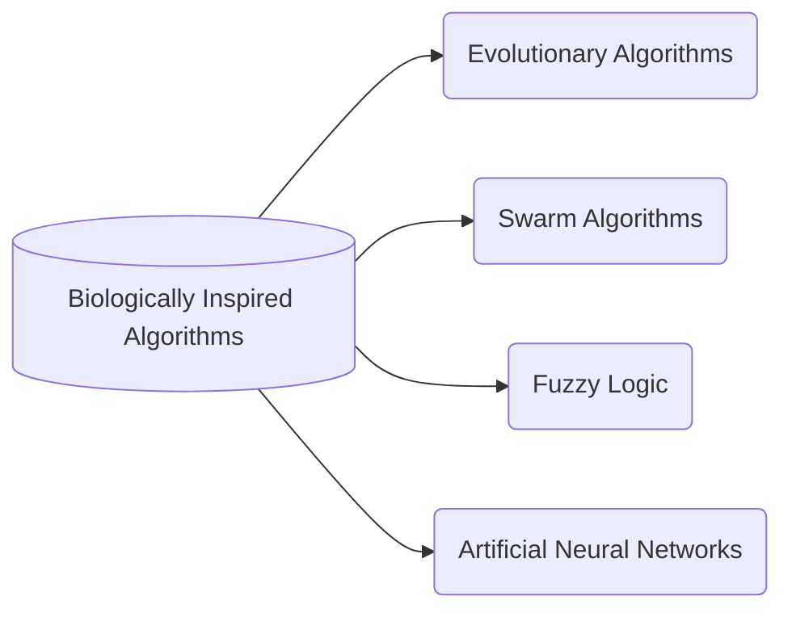
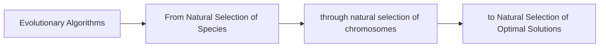
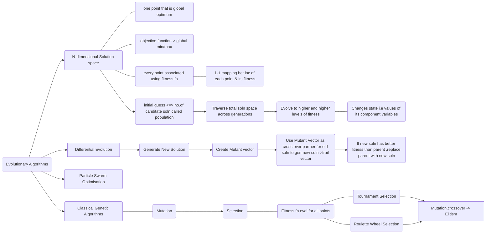
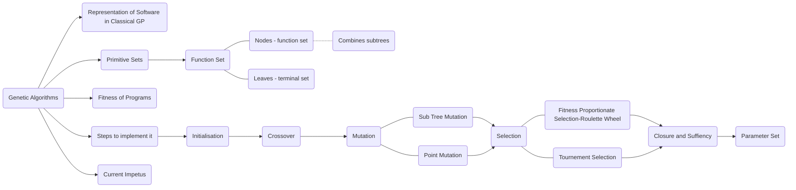

# Search Techniques and Heuristics

     
     

|Methods|Complete(1/0)|Optimal(1/0)|Space Complexity|Time Complexity|
|:---|:----:|:---:|:---:|:----:|
| BFS|1|0|$O(b^d)$|$O(b^d)$|
| DFS|1|0|$O(mb)$|$O(b^d)$|
| UFS|1|1|$O(mb)$|$O(b^{1+floor(\frac{C^*}{\epsilon})})$|
| Bidirectional Search|1|-|$O(bd)$|$O(b^{\frac{d}{2}})$|
| Greedy Best First Search|0|0|$O(b^m)$|$O(b^m)$|
| $A^*$ Search|1|1|-|-|
| Min Max Algorithm|1|1|$O(mb)$|$O(b^m)$|

# Game Theory

# Constraint Satisfaction Problem

# Logic and AI

# Ai And Planning

# Fuzzy Logic

# Evolutionary Algorithms

# Genetic Programming

