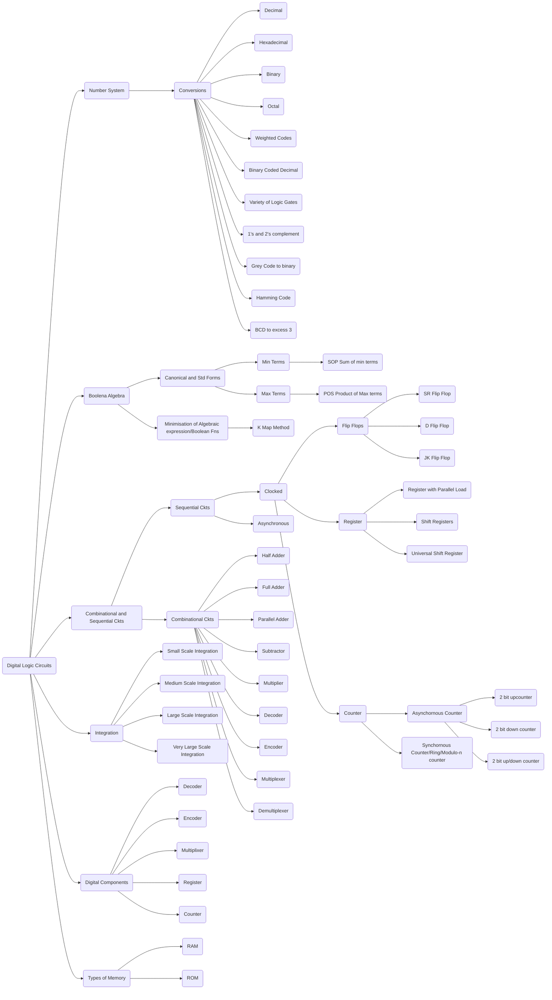
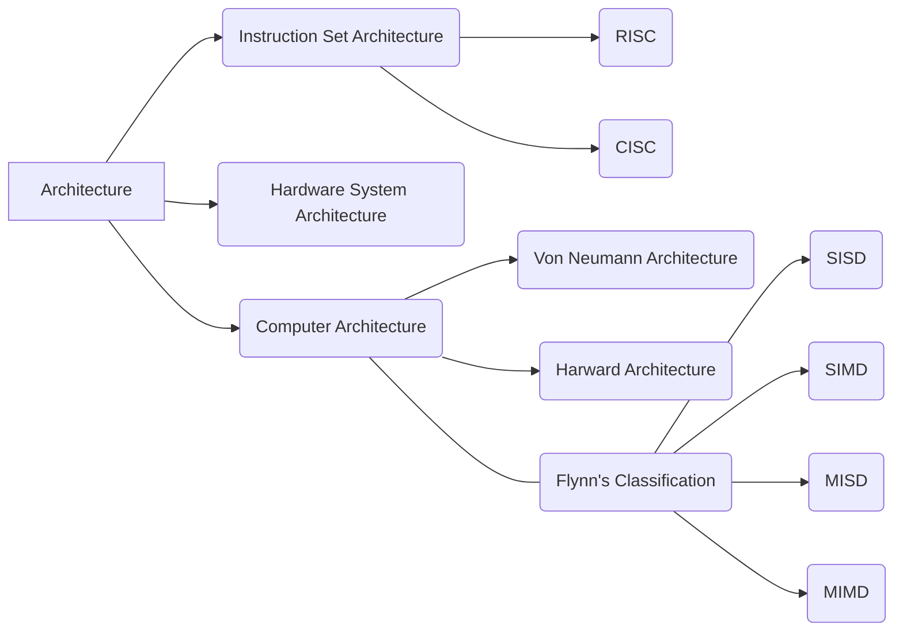
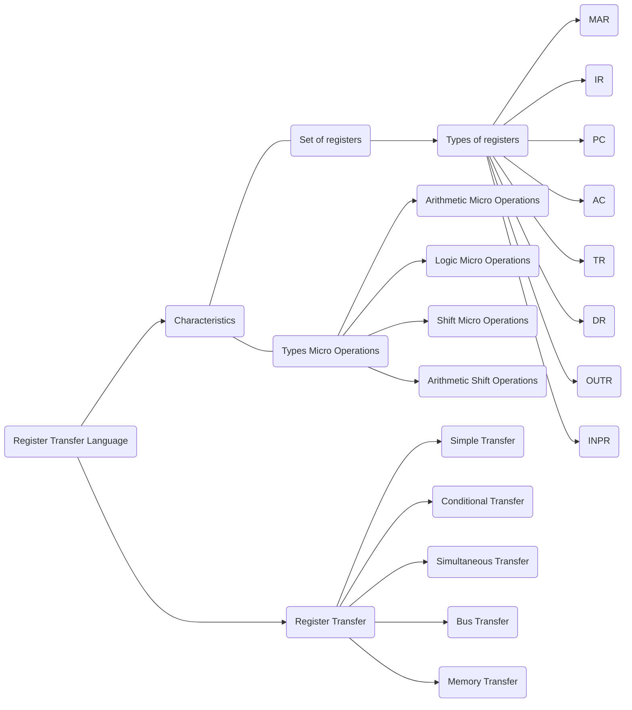
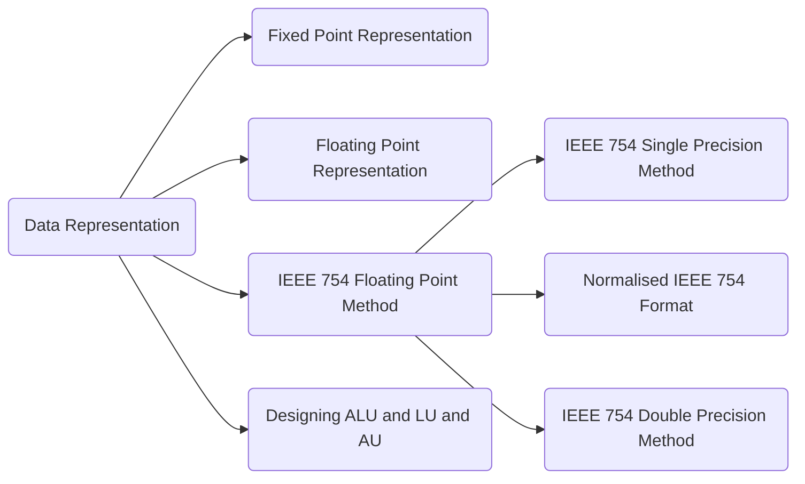
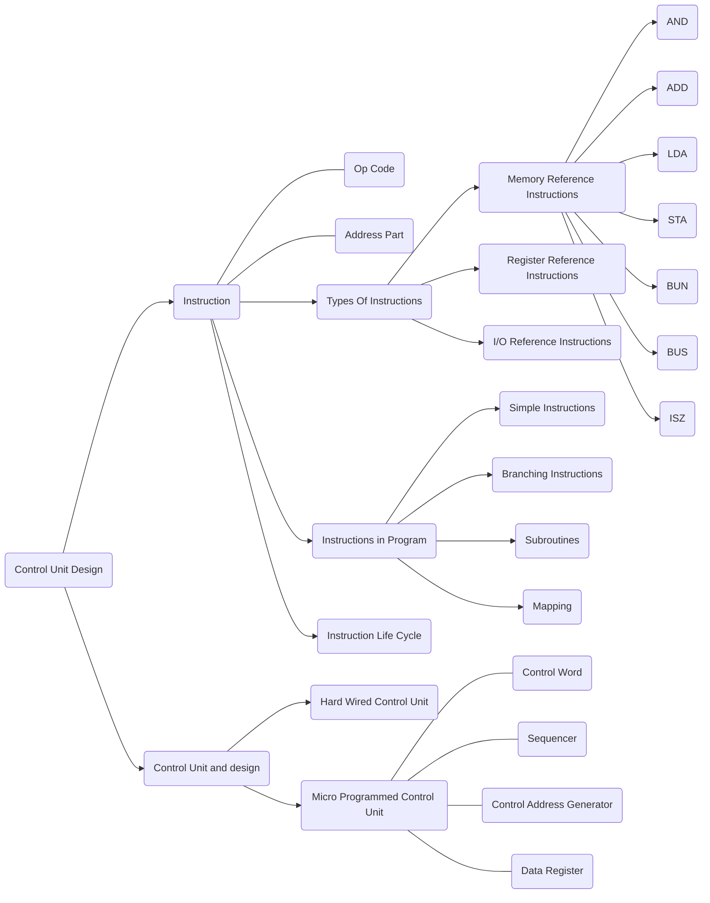
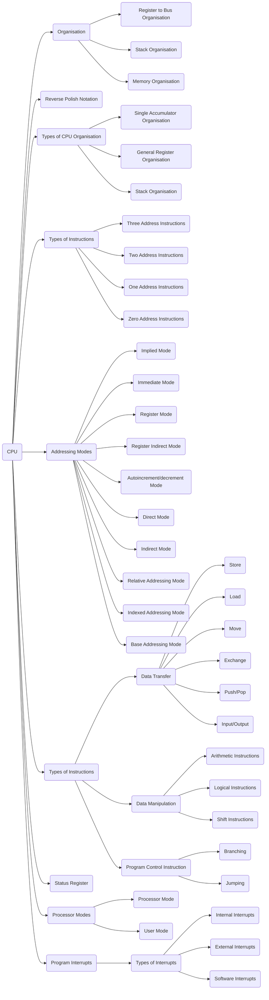
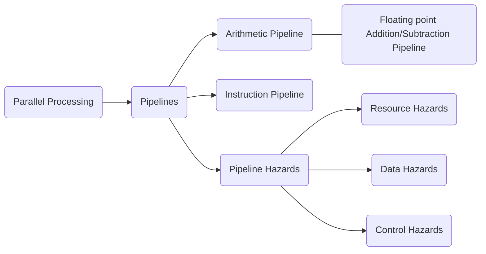
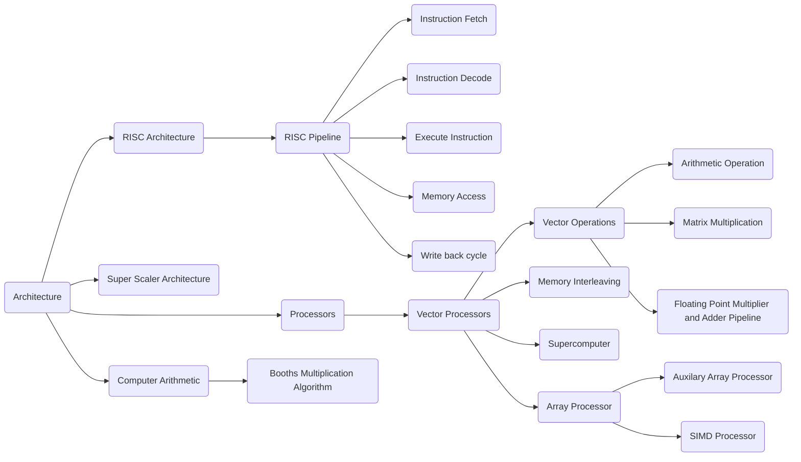

# Digital Logic Circuits

# Computer Organisation and Architecture:

# Register Transfer Language

# Data Representation

# Control Unit Design

# CPU

# Parallel Processing

# RISC and CISC Architecture
