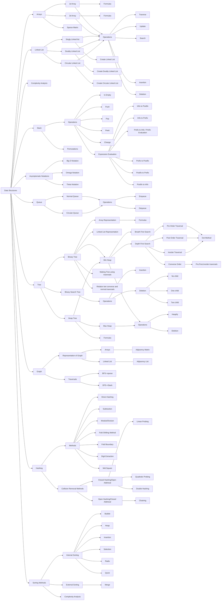

#### DATA STRUCTURES

```mermaid
graph LR;

A[Data Structures] --> B[Arrays] 
    B --> BA[1d Array]
        BA --> BAA[Formulas]
    B --> BB[2d Array]
        BB --> BBA[Formulas]
        BA & BB --> BBB[Operations]
            BBB --> BBBA[Traverse]
            BBB --> BBBB[Update]
            BBB --> BBBC[Search]
            BBB --> BBBD[Insertion]
            BBB --> BBBE[Deletion]
    B --> BC[Sparse Matrix]


A --> C[Linked List]
    C --> CA[Singly Linked list]
        CA --> CAB[Create Linked List]
    C --> CB[Doubly Linked List]
        CB --> CBA[Create Doubly Linked List]
    C --> CC[Circular Linked List]
        CC --> CCA[Create Circular Linked List]
        CA & CB & CC--> BBB

A --> D[Complexity Analysis]
A --> E[Stack]
    E --> EA[Operations]
        EA --> EAA[Is Empty]
        EA --> EAB[Push]
        EA --> EAC[Pop]
        EA --> EAD[Peek]
        EA --> EAE[Change]
        EA --> EAF[Expression Evaluation]
            EAF -->EAFA[Infix to Postfix]
            EAF -->EAFB[Infix to Prefix]
            EAF -->EAFC[Prefix to Infix / Prefix Evaluation]
            EAF -->EAFD[Prefix to Postfix]
            EAF -->EAFE[Postfix to Prefix]
            EAF -->EAFF[Postfix to Infix]

    E --> EB[Permutations]

A --> F[Asymptomatic Notations]
    F --> FA[Big O Notation]
    F --> FB[Omega Notation]
    F --> FC[Theta Notation]

A --> G[Queue] 
    G --> GA[Normal Queue]
        GA --> GAA[Operations]
            GAA --> GAAA[Enqueue]
            GAA --> GAAB[Dequeue]
    G --> GB[Circular Queue]
        GB --> GAA

A --> H[Tree]
    H --> HA[Binary Tree]
        HA --> HAA[Array Representation]
            HAA --> HAAA[Formulas]
        HA --> HAB[Linked List Representation]
        HA --> HCA[Traversals]
            HCA --> HCAA[Breath First Search]
            HCA --> HCBB[Depth First Search]
                HCBB --> HCBBA[Pre Order Traversal]
                HCBB --> HCBBB[Post Order Traversal]
                HCBB --> HCBBC[Inorder Traversal]
                    HCBBA & HCBBB & HCBBC --> HCBBCA[Dot Method]
                HCBB --> HCBBD[Converse Order]
                    HCBBD --> HCBBDA[Pre,Post,Inorder traversals]
        HA --> HDA[Making Tree using traversals]
        HA --> HEA[Relation bet converse and normal traversals]

    H --> HB[Binary Search Tree]
            HB --> HBA[Operations]
            HBA --> HBAA[Insertion]
            HBA --> HBAB[Deletion]
                HBAB --> HBABA[No child]
                HBAB --> HBABB[One child]
                HBAB --> HBABC[Two child]
    
    H --> HC[Heap Tree]
        HC --> HCA[Min Heap]
        HC --> HCB[Max Heap]
        HCA & HCB --> HCBA[Operations]
            HCBA --> HCBAA[Heapify]
            HCBA --> HCBAB[Deletion]
        HC --> HCC[Formulas]

A --> I[Graph]
    I --> IA[Representation of Graph]
        IA --> IAA[Arrays]
            IAA --- IAAAA[Adjacency Matrix]
        IA --> IAB[Linked List]
            IAB --- IABA[Adjacency List]
    I --> IB[Traversals]
        IB --> IBA[BFS->queue]
        IB --> IBB[DFS->Stack]
    
A --> J[Hashing]
    J --> JA[Methods]
        JA --> JAA[Direct Hashing]
        JA --> JAB[Subtraction]
        JA --> JAC[Module/Division]
        JA --> JAD[Fold Shifting Method]
        JA --> JAE[Fold Boundary]
        JA --> JAF[Digit Extraction]
        JA --> JAG[Mid Square]
    J --> JB[Collision Removal Methods]
        JB --> JBA[Closed Hashing/Open Addresal]
            JBA --> JBAA[Linear Probing]
            JBA --> JBAB[Quadratic Probing]
            JBA --> JBAC[Double Hashing]
        JB --> JBB[Open Hashing/Closed Addresal]
            JBB --> JBBA[Chaining]

A --> K[Sorting Methods]
    K --> KA[Internal Sorting]
        KA --> KAA[Bubble]
        KA --> KAB[Heap]
        KA --> KAC[Insertion]
        KA --> KAD[Selection]
        KA --> KAE[Radix]
        KA --> KAF[Quick]
    K --> KB[External Sorting]
        KB --> KBA[Merge]
    K --> KC[Complexity Analysis]
```