#### Transportation Problem
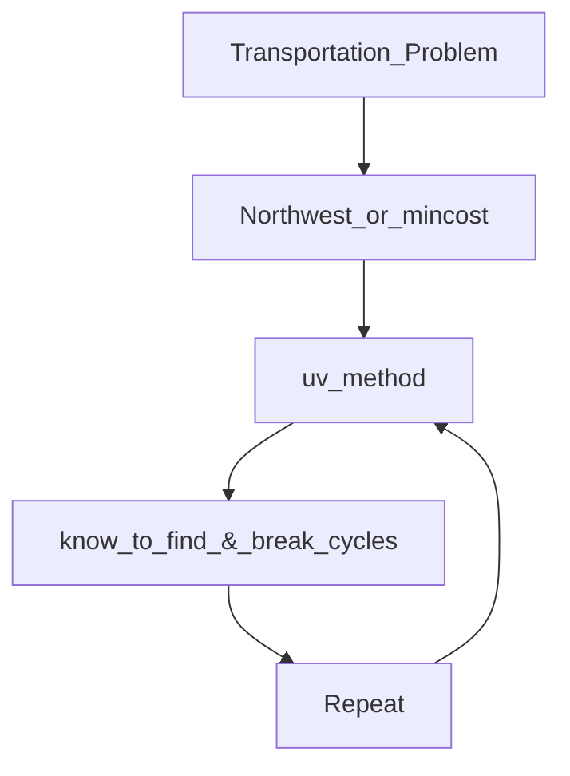

#### TSP
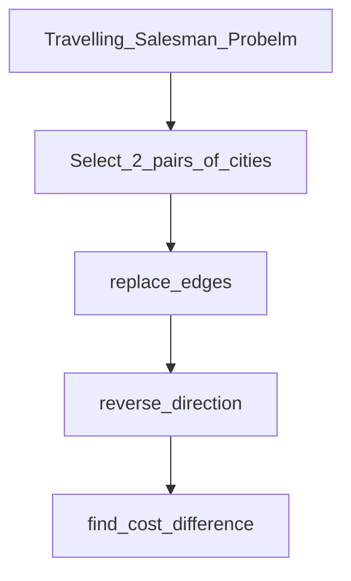

#### Revised Simplex Method
```mermaid
graph TD;
    Revised_Simplex_method-->X_B,Xn=0-->Get_B-->X_B=Bb-1&Xn=0-->Obj=CbB-1b-->Optimality_Check-->Adjacent_BFS-->Repeat-->Optimality_Check
```
#### Integer Linear Programming
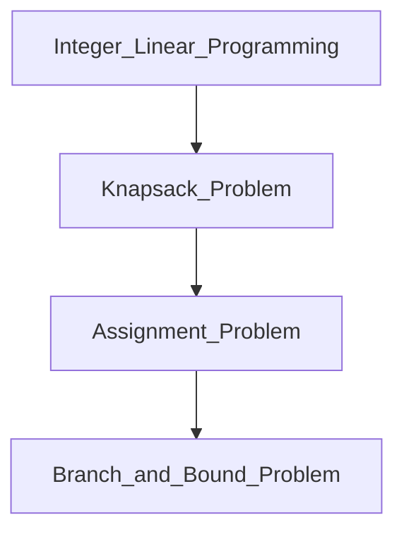

#### Knapsack Problem
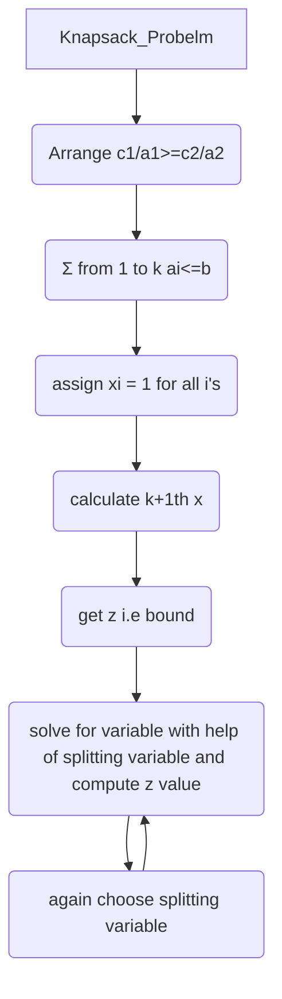

#### Assignment Problem
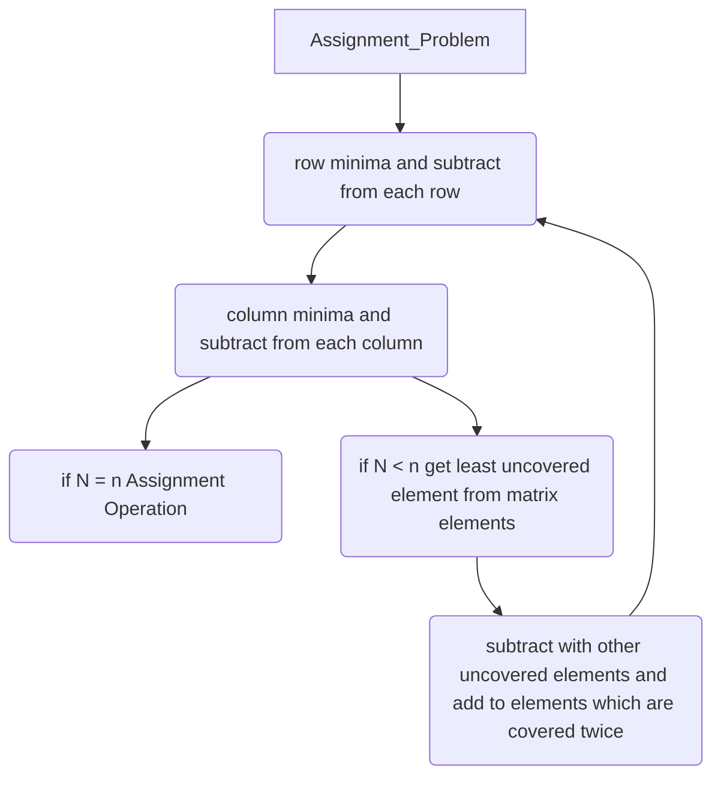

#### Branch and Bound for TSP
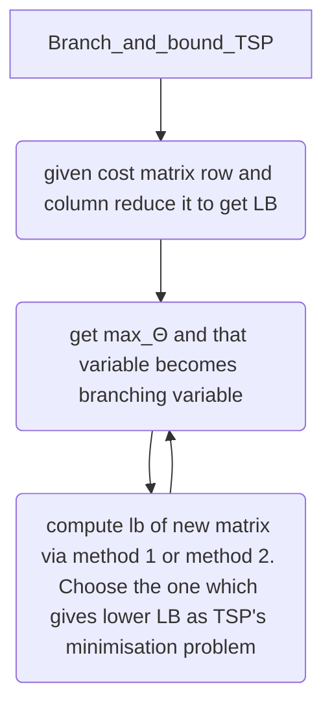
#### Minimization of Non Linear Functions
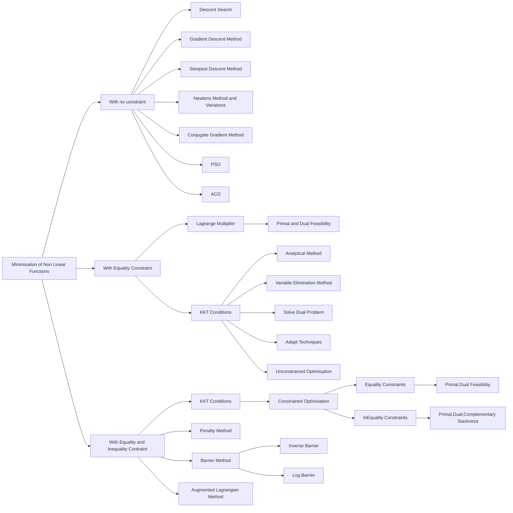

#### Review on Unconstrained Non Linear Optimisation
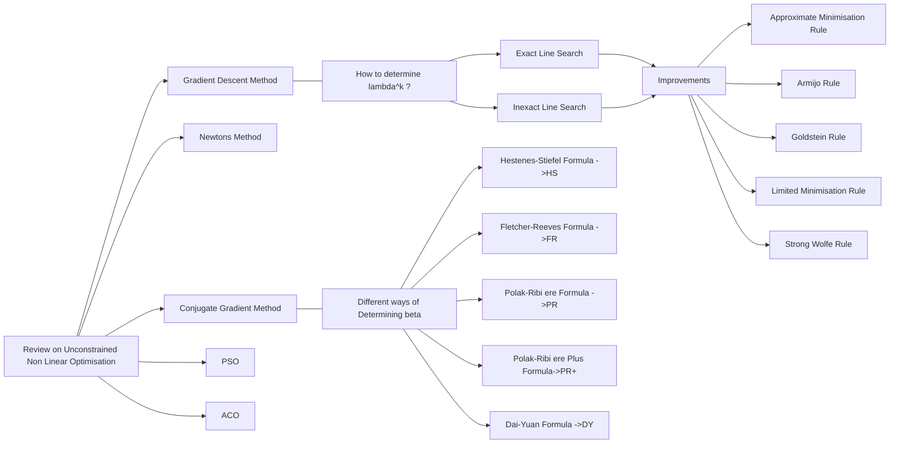
#### 
#### Special Techniques for Optimisation in AI
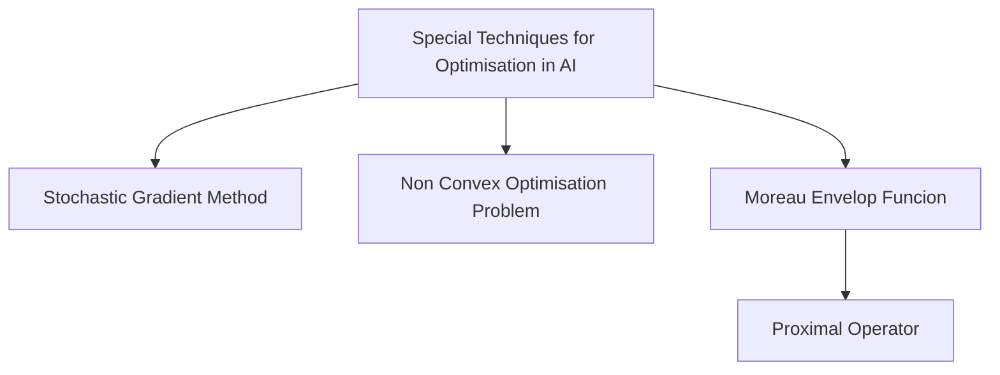

#### SVM
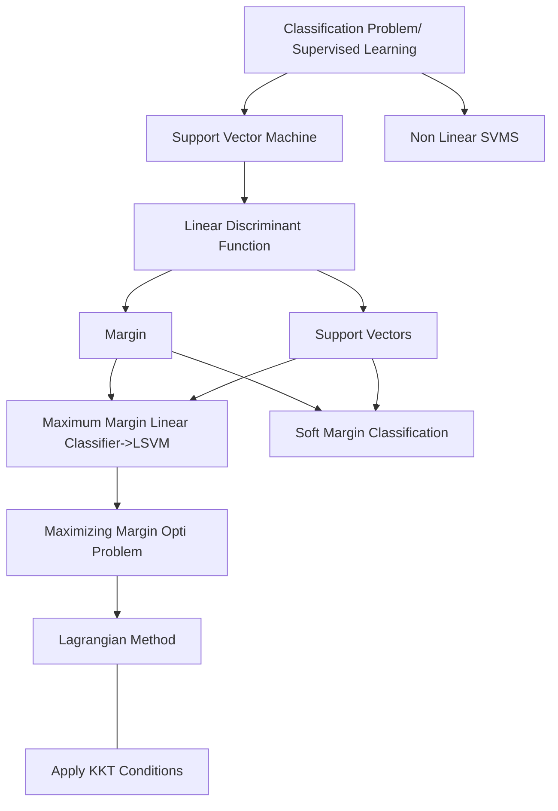

#### Subgradient
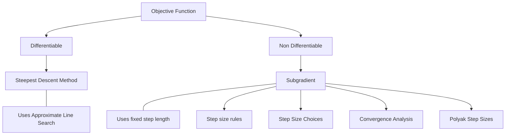

#### Game Theory
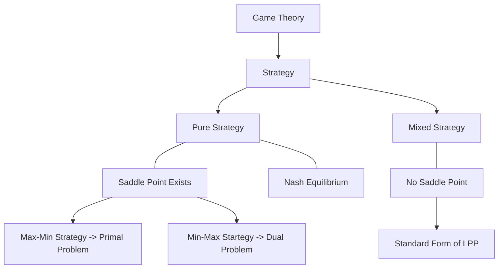

#### Recommender Systems
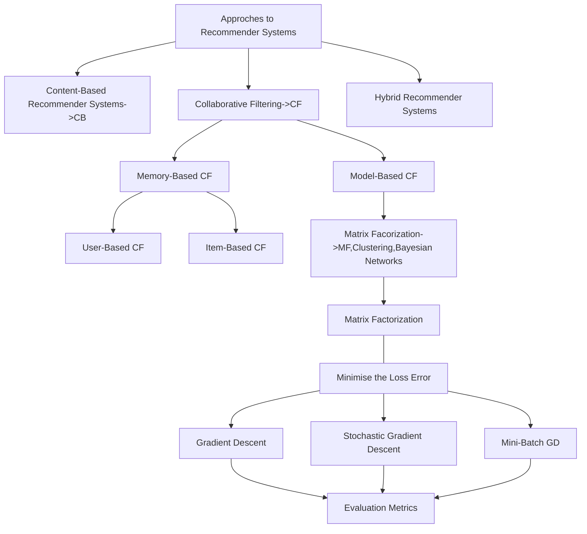
#### Neural Networks
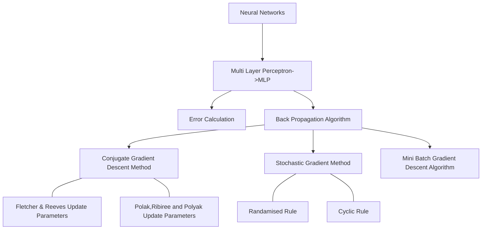
#### Case Studies
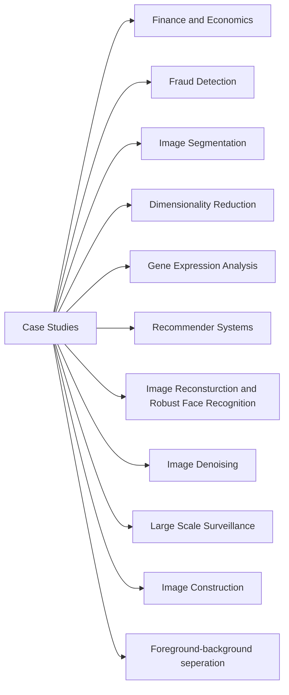
#### Image Processing
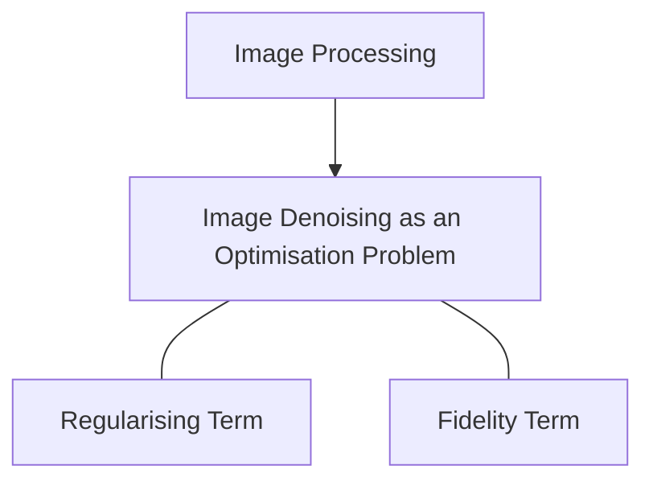

#### Others
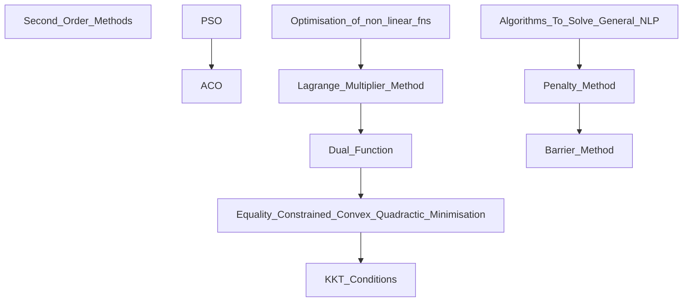